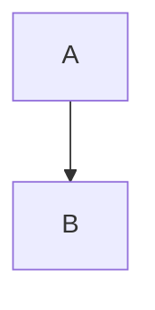

# Hard text

<!-- an HTML comment -->

<marquee>a tag outside the policy</marquee>

zero​width

a < b, Map<String, Int>, Tom & Jerry, a literal &amp;lt;, it's "quoted".

```mermaid
graph TD; A-->B;
```
